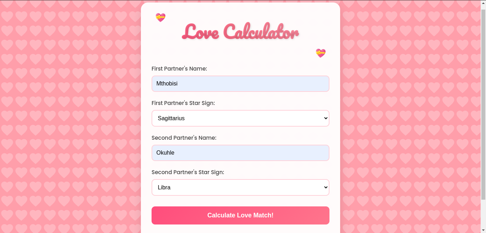
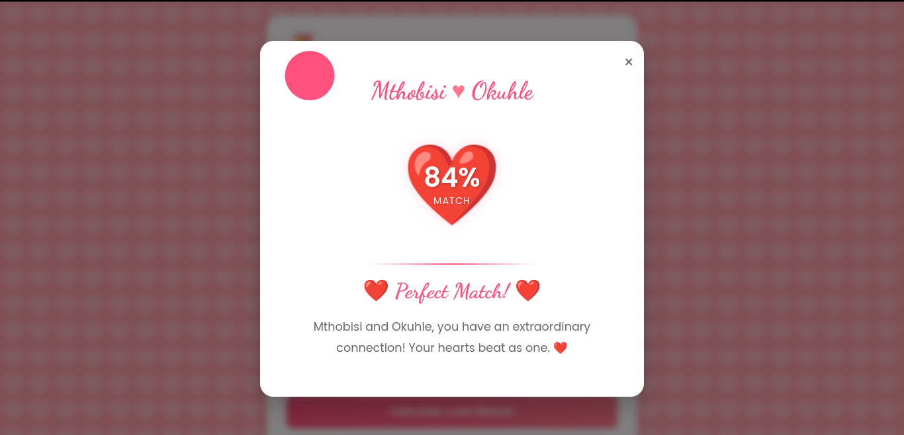

# Love Calculator

This is a fun project that emulates the love calculators popular during school days. Users can input two names and their star signs to calculate their "love match." The project is built using HTML, CSS, and JavaScript.

## Features
- Enter names and star signs for two individuals.
- Calculates a "love match" percentage.
- Displays a styled modal with the result.
- Responsive and visually appealing design.

## File Structure
```
LoveCalculator/
├── home.html        # Main HTML file
├── home.js           # JavaScript functionality
└── assets/           # Contains images
    ├── screenshot1.png
    └── screenshot2.png
```

## How to Run
1. Clone or download this repository.
2. Ensure all files are in the same directory.
3. Open `home.html` in your browser.

## Screenshots
Below are screenshots of the Love Calculator:

### Input Page


### Result Page


## History and Inspiration
The inspiration for this project comes from the playful love calculators we used in primary school to check "compatibility" with friends or crushes. This project aims to recreate that nostalgic experience using modern web technologies while adding a fun and interactive twist to it. It combines humor and creativity to bring back childhood memories.

## How It Works
1. User enters the names and star signs in the input fields.
2. Clicking the "Calculate Love Match!" button triggers the JavaScript function to compute the result.
3. The result is displayed in a styled modal with the match percentage and a short message.


## Future Improvements
- Add more detailed compatibility logic based on star signs.
- Enhance the UI with animations.
- Allow users to share results on social media.

## Credits
Built with ❤️ by Mthobisi Latha.
